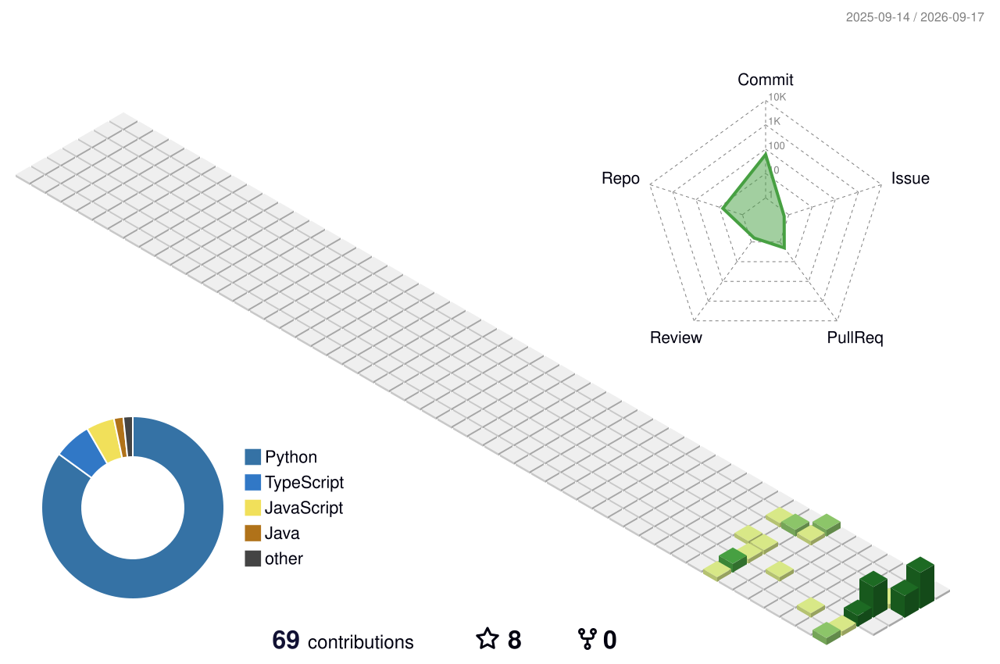

  
  
  
  
  

  

  
  
  

---

### 👋 About Me

- 🧑‍💻 Full-stack developer with **4+ years** of experience, based in **Shanghai**
- 🎯 Focus on **frontend engineering**, **monorepo tooling**, and **Rust / Node.js** backends
- 🛠️ Building with **Vue**, **React**, **Solid**, **Svelte**, **NestJS**, **gRPC**, and **GraphQL**
- 📝 Writing on my blog: [new-blog-sooty.vercel.app](https://new-blog-sooty.vercel.app/fe/introduction)

### 🧰 Tech Stack

| Category | Tools |
| --- | --- |
| **Languages** |     |
| **Frontend** |     |
| **Backend & Infra** |     |
| **Tooling** |     |
| **Databases** |  |
| **IDE** |    |

### ⭐ Featured Projects

| Project | Description | Stack |
| --- | --- | --- |
| [**GD-FE**](https://github.com/ChuTingzj/GD-FE) | Frontend application | TypeScript |
| [**GD-BE**](https://github.com/ChuTingzj/GD-BE) | Backend service | TypeScript |
| [**tabs-master**](https://github.com/ChuTingzj/tabs-master) | Chrome extension for tab management | TypeScript |
| [**new-blog**](https://github.com/ChuTingzj/new-blog) | Personal blog built with Astro | Astro |
| [**file2vector**](https://github.com/ChuTingzj/file2vector) | Excel ArrayBuffer to Vector / Array | Rust |
| [**bff-graphql**](https://github.com/ChuTingzj/bff-graphql) | BFF on NestJS, gRPC, and GraphQL | TypeScript |
| [**get_weather**](https://github.com/ChuTingzj/get_weather) | Weather fetcher with OpenWeather | Rust |

### 📈 GitHub Activity

  
  

  

### 📫 Connect With Me

  
  
  

### 🏆 GitHub Trophies

  

### 📊 Star History

  

  <strong>Thanks for visiting ❤️</strong>

